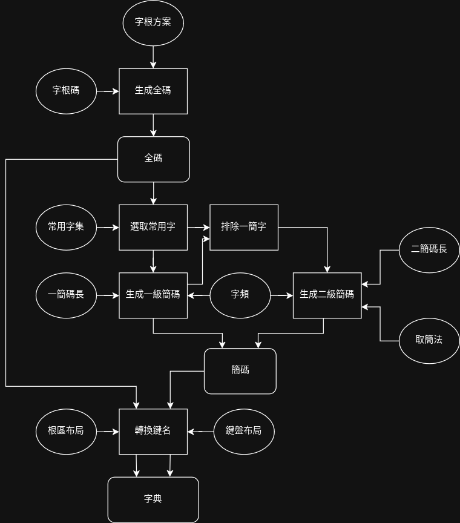

# 新鄭
這是一个制作形碼的框架。

## 流程圖

## 字頻來源
- 繁體
    - 教育部語文成果網
    - [字頻總表](https://language.moe.gov.tw/001/Upload/files/SITE_CONTENT/M0001/PIN/biau1.htm)
- 简体
    - 北京语言大学，邢红兵 xinghb@blcu.edu.cn
    - [25亿字语料汉字字频表](https://faculty.blcu.edu.cn/xinghb/zh_CN/article/167473/content/1437.htm)
